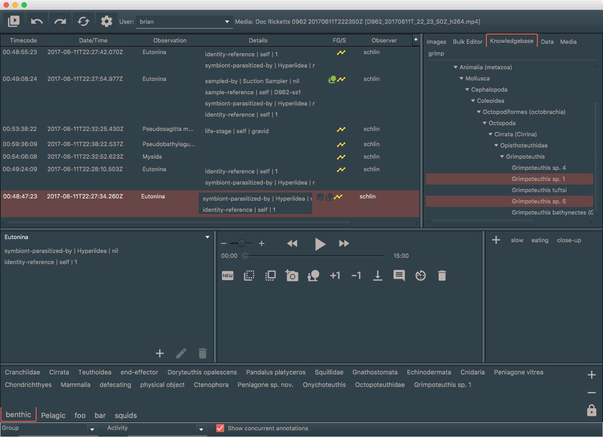

# vars-annotation

  

MBARI's Video Annotation and Reference System user interface for creating and editing video selectedAnnotations. This version is a complete rewrite of the older [VARS](https://hohonuuli.github.io/vars/) system. It is targeted at more modern video workflows and is part of [MBARI's Media Management](https://mbari-media-management.github.io/) software stack. This is NOT a standalone application. There are a number of external services that need to be deployed in order for this application to function.

This system is the main annotation application used at [MBARI](https://www.mbari.org).

