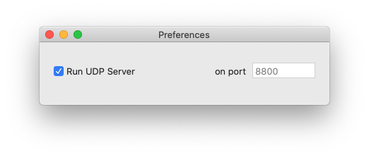
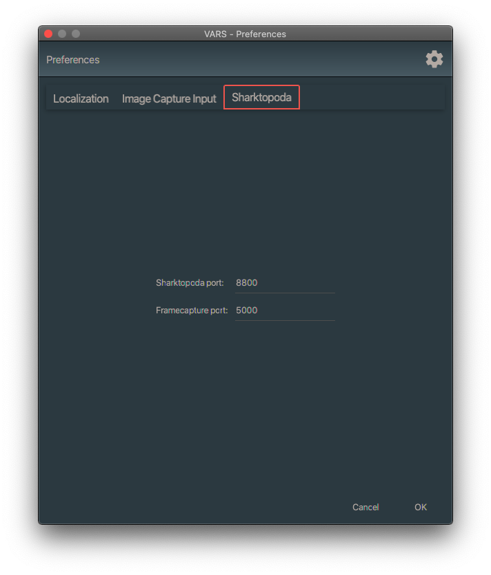

# Using VARS with Sharktopoda

## Overview

[Sharktopoda](https://github.com/mbari-org/Sharktopoda) is the recommended video player for use with VARS. It is a macOS application that provides:

- Robust video playback for H.264 and ProRes codecs
- **Localization support** — draw bounding boxes directly on the video to define spatial regions of interest for annotations

## Installation

Download the latest release of [Sharktopoda](https://github.com/mbari-org/Sharktopoda).

## Configuration

Sharktopoda and VARS communicate via a simple [UDP](https://en.wikipedia.org/wiki/User_Datagram_Protocol) protocol. Both applications must be configured to use the same UDP port number.

### Configuring Sharktopoda

Launch Sharktopoda and go to _Sharktopoda_ > _Preferences_. Set the port number — at MBARI we typically use `8800`. Make sure the **Run UDP Server** checkbox is checked.

### Configuring VARS

1. Launch VARS Annotation
2. Open **Settings** (gear icon on the toolbar)
3. Select the **Sharktopoda** tab
4. Set the **Sharktopoda port** to match the value you set in Sharktopoda (e.g. `8800`)
5. The **Framecapture port** can be left at its default value

## Drawing Bounding Boxes

With both VARS and Sharktopoda running, open a video in VARS as normal. When you spot something of interest in the video, click and drag a bounding box around it directly in Sharktopoda. This creates a new annotation in VARS with the bounding box stored as a localization.

If you are working with localizations, verify the annotation settings in Sharktopoda under _Sharktopoda_ > _Preferences_:

