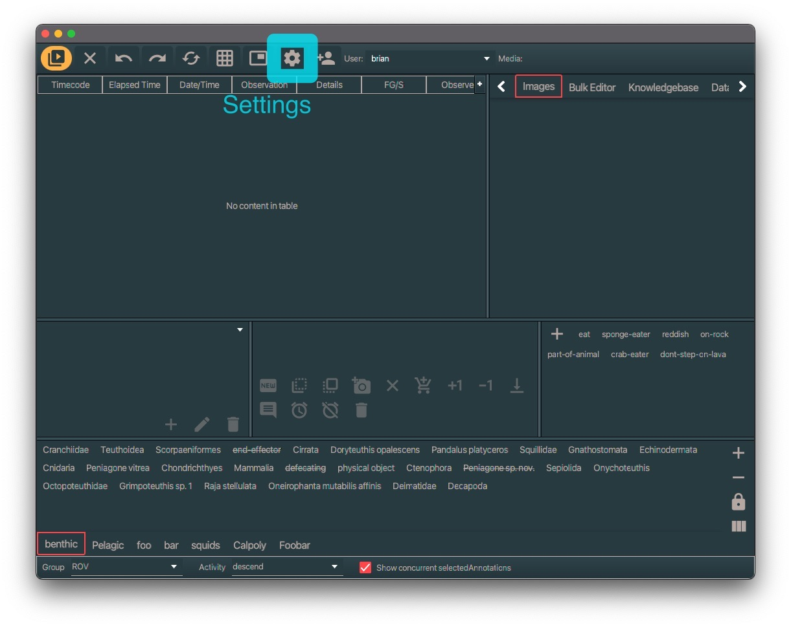
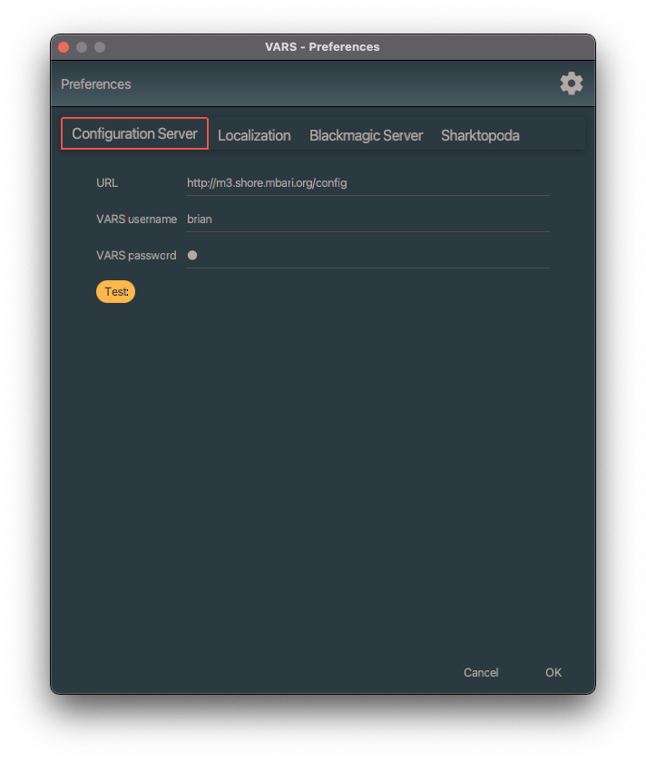
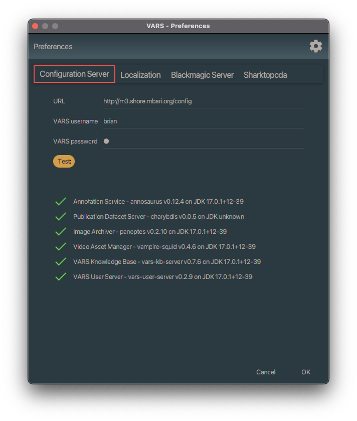
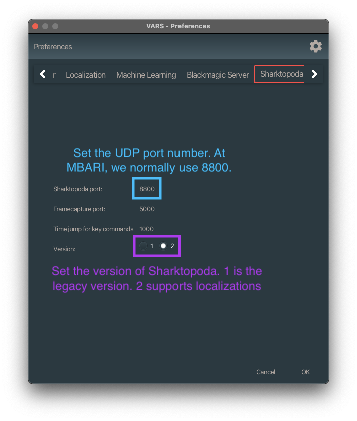
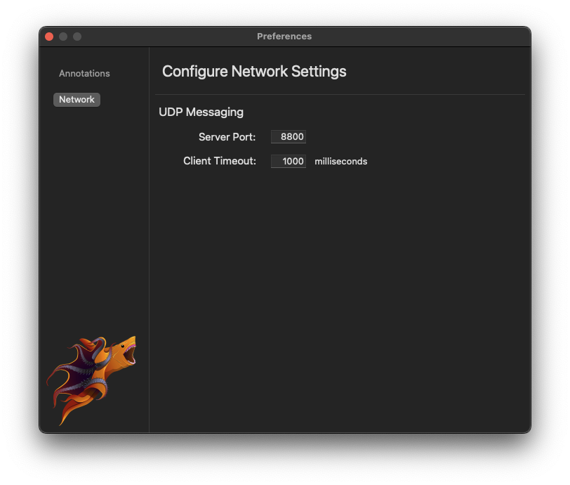
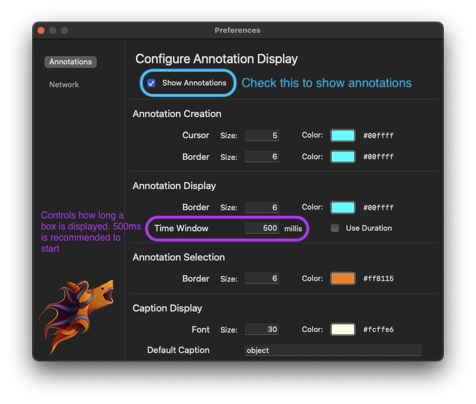
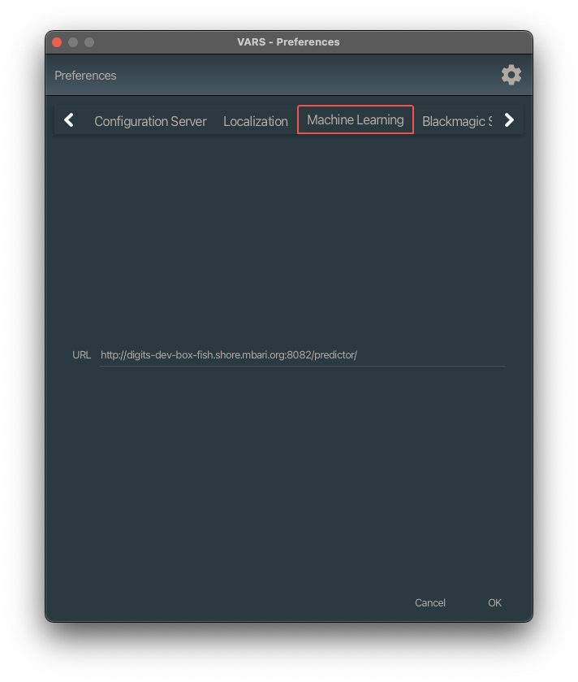
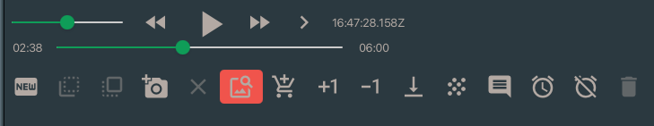
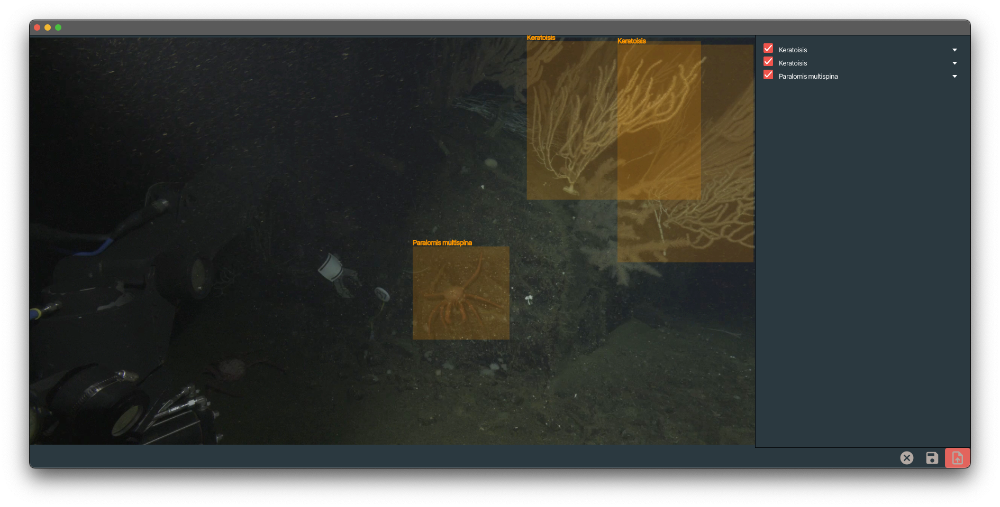

# VARS Annotation Setup

## Service Configuration

VARS requires a running backend microservice stack. The [vars-quickstart-public](https://github.com/mbari-org/vars-quickstart-public) project provides a Docker-based setup for all required services. Once the backend is running:

1. Download VARS from [GitHub](https://github.com/mbari-org/vars-annotation/releases).
2. On macOS, if you see a message that VARS is damaged and can't be opened, Apple's Gatekeeper is blocking it. To bypass it:
    1. Open a terminal (Terminal.app is in `/Applications/Utilities`).
    2. `cd` to the folder where VARS is installed, for example `cd /Applications`.
    3. Run `sudo xattr -d -r com.apple.quarantine "VARS Annotation.app"`.
    4. Relaunch VARS Annotation.
3. Point VARS at your [configuration server](https://github.com/mbari-org/raziel) (Raziel), as described below.

### Open the settings dialog

Click the settings button.

### Add your configuration server

Enter the URL of your Raziel configuration server, along with your VARS username and password.

### Test your configuration

Click **Test** to verify the connection. If your dialog looks like the image below, click **OK**.

## Video Player Configuration

VARS communicates with external video players using [UDP](https://en.wikipedia.org/wiki/User_Datagram_Protocol). VARS and the video player must be configured to use the same UDP port number.

### VARS port setting

### Sharktopoda port setting

In Sharktopoda, open __Sharktopoda > Preferences__:

### Sharktopoda annotation settings

If you are working with localizations (bounding boxes drawn directly on video), check these settings in Sharktopoda:

## Machine Learning Configuration

### Configure the ML endpoint

VARS can send the current video frame to a remote server that applies machine learning to the image. To configure this, enter the URL of your ML endpoint in the settings dialog.

### Use ML

Click the ML button to send the current frame to the ML service. A window shows the proposed annotations. **These annotations are not saved to the database until you explicitly accept them.**

The ML window displays the captured frame along with the proposed annotations:

Use the checkbox next to a proposed annotation to deselect it, and use the combo box to edit its concept name. When you're ready, click one of the three buttons at the bottom:

1. **Cancel**: close the window without saving anything.
2. **Save annotations**: save the accepted annotations to the database.
3. **Save annotations and image**: save the annotations and create a framegrab from the ML window.
