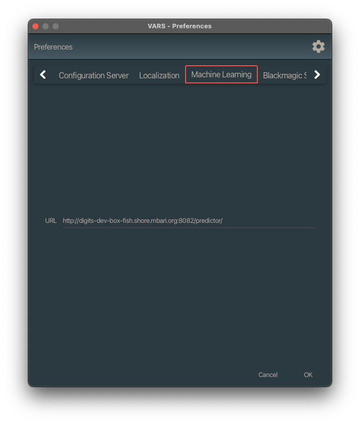

# VARS Annotation Setup

## Configuration

### Service Configuration

VARS requires a running backend microservice stack. The [vars-quickstart-public](https://github.com/mbari-org/vars-quickstart-public) project provides a Docker-based setup for all required services. Once the backend is running, do the following:

1. Download VARS from [GitHub](https://github.com/mbari-org/vars-annotation/releases)
2. If you're on macOS and get a message that VARS is damaged and can't be opened, that's Apple's Gatekeeper security. To bypass it:
    1. Open a terminal (Terminal.app is in `/Applications/Utilities`)
    2. `cd` to where VARS is installed, e.g. `cd /Applications`
    3. Run `sudo xattr -d -r com.apple.quarantine "VARS Annotation.app"`
    4. Relaunch VARS Annotation
3. Point VARS at your [configuration server](https://github.com/mbari-org/raziel) (Raziel).

#### First, click on the settings button

#### Add your configuration server

Enter the URL to your Raziel configuration server along with your VARS username and password.

#### Test your configuration

Click the **Test** button to verify the connection. If your dialog looks like the image below, click **OK**.

### Video Player Configuration

VARS communicates with external video players via [UDP](https://en.wikipedia.org/wiki/User_Datagram_Protocol). Both VARS and the video player must be configured to use the same UDP port number.

#### VARS Port setting

#### Sharktopoda Port Setting

Under __Sharktopoda > Preferences__:

### Sharktopoda Annotation Settings

If you are working with localizations (bounding boxes drawn directly on video), check these settings in Sharktopoda:

### Machine Learning Configuration

#### ML Configuration

VARS can send the current video frame to a remote server where machine learning is applied to the image. To configure this, enter the URL of your ML endpoint in the settings dialog.

#### ML Usage

Click the ML button to send the current frame to the ML service. A window will appear showing proposed annotations. **These annotations are not saved to the database until you explicitly accept them.**

The ML window displays the captured frame along with the proposed annotations:

You can deselect any proposed annotation using the checkbox next to it, and edit the concept name using the combo box. When you're ready, use one of the three buttons at the bottom:

1. **Cancel** — close without saving anything
2. **Save annotations** — send the accepted annotations to the database
3. **Save annotations and image** — save the annotations and create a framegrab from the ML window
