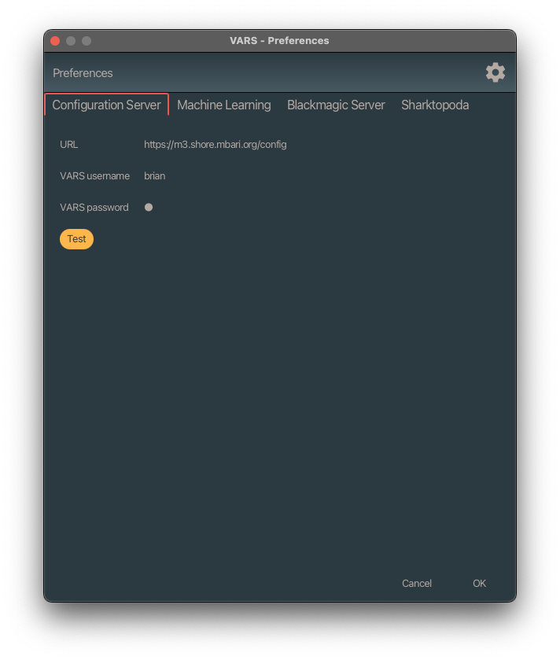

# VARS Annotation Setup

## Configuration

### Service Configuration

VARS requires that you have setup a microservice stack needed to power VARS. The [vars-quickstart-public](https://github.com/mbari-org/vars-quickstart-public) project provides a Docker-based setup for all required services. Once that's done you can do the following:

1. Download VARS from [GitHub](https://github.com/mbari-org/vars-annotation/releases)
2. If you're running on macOS, and you get a message that VARS is damaged and can't be opened, you can ignore that message. That's Apple's super aggressive security. To fix that:
    1. Open a terminal (The Terminal.app is located in /Applications/Utilities).
    2. cd to where VARS is downloaded. e.g. `cd /Applications`
    3. Run `sudo xattr -d -r com.apple.quarantine "VARS Annotation.app"`
    4. Relaunch VARS Annotation
3. Point VARS at your [configuration server](https://github.com/mbari-org/raziel).

#### First, click on the settings button

#### Add your configuration server

This should include the URL to your config server and the login (username, pwd) for one of the user accounts in VARS.

#### Test your configuration

Click the test button to verify that VARS is configured. If your dialog looks like the image below, just click the 'OK' button.

### Video Player Configuration

VARS communicates with custom external video players via [UDP](https://en.wikipedia.org/wiki/User_Datagram_Protocol). Both VARS and the video player (e.g. Sharktopoda) need to have the UDP port number set to the same value:

#### VARS Port setting

#### Sharktopoda 1 Port Setting

Under __Sharktopoda > Preferences__:

#### Sharktopoda 2 Port Setting

Under __Sharktopoda > Preferences__:

### Sharktopoda 2 Annotation Settings

If you are working with localizations you should check these settings in Sharktopoda 2:

#### Cthulhu Port Setting

Open the prefereces by clicking on the gear icon:

Then on the network tab set the control port:

### Machine Leaning Configuration

#### ML Configuration

VARS can send the current video frame to a remote server where machine learning can be applied to the image. To configure, simply enter the URL to the ML endpoint. For internal use, that endpoint is: <http://perceptron.shore.mbari.org:8080/predictor/>

#### ML Usage

To use machine learning, click on the ML button. This will show a window with prposed annotations. These annotations are NOT sent to teh database until you accept them with one of the save buttons at the bottom of the window.

This will grab the current frame of video and display it like:

You can remove ml proposed annotations by removing the check next to the annotation. You can edit the annotation by clicking by the combo box. Once you've made the edits, you can use one fo the three buttons at the bottom. They are:

1. Cancel (nothing is saved to the database)
2. Save the annotations only. This will send them to the database and display them in VARS.
3. Save annotations and image. This will create a framegrab from the ML window as well as save the annotations to VARS.

