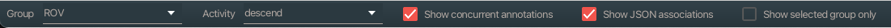
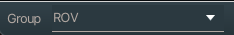
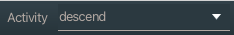
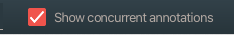
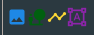
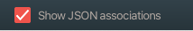
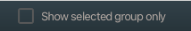

# VARS Annotation's Status Bar

## Group

A _group_ is a field on every annotations. This control shows all groups currently used on annotations in VARS. New groups can be added by typing the new group name in this control and creating an annotation that uses that group.

When a new annotation is created it is assigned the group value show in this control. An annotation's group can be changed by using the controls in the _Bulk Editor_ panel.

## Activity

An _activity_ is a field on every annotation. This control functions exactly the same as the group control. An annotation's activity can be changed in the _Bulk Editor_ panel.

## Show concurrent annotations

VARS supports the concept of overlapping videos. For example, annotations for a portion of a deployment or dive could be done in real time, on the master copy of video, or against a proxy video. Annotations on different videos that overlap with the video currently being annotated are called _concurrent annotations_.

When this box is not checked, only annotations made on the video opened in VARS are shown. When it is checked, annotations for the same deployment but on other videos are shown. Only concurrent annotations that have timestamps within the current video are shown. Concurrent annotations will show the yellow symbol (below) next to them in the FG/S column.

## Show JSON associations

Assocations, also called Details, can be stored in a variety of formats. At MBARI, we commonly use JSON to store localization data. However, the volume of this data can quickly clutter up the annotation interface. When this box is checked, all associations are displayed. When it is not checked, JSON associations are not shown.

If an annotation has JSON associations, a purple icon (below) is displayed in the FG/S column.

## Show selected group only

As MBARI accommodates machine learning annotations, we will be putting them into their own _group_. When this box is checked only annotations that belong to the group listed in the group control will be displayed. When not checked, all annotations will be displayed.
