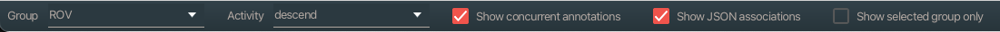
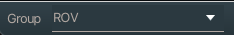
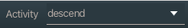
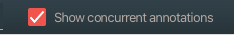
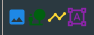
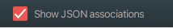
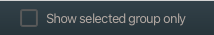

# VARS Annotation Status Bar

The status bar contains controls that affect how annotations are created and displayed in VARS.

## Group

A _group_ is a field on every annotation. This control lists all groups in use across the loaded annotations. To create a new group, type its name into this control and then create an annotation.

When you create an annotation, it is assigned the group shown in this control. You can change an annotation's group later using the _Bulk Editor_ panel.

## Activity

An _activity_ is a field on every annotation. This control works the same way as the group control. You can change an annotation's activity in the _Bulk Editor_ panel.

## Show concurrent annotations

VARS supports overlapping videos. For example, part of a deployment might be annotated in real time on a master copy of the video and also against a proxy video. Annotations on different videos that overlap the currently open video are called _concurrent annotations_.

When this box is unchecked, VARS shows only annotations made on the open video. When checked, VARS also shows annotations from other videos in the same deployment, but only those whose timestamps fall within the open video's time range. Concurrent annotations display a yellow symbol in the FG/S column.

## Show JSON associations

Associations (also called _details_) can be stored in various formats. JSON is commonly used to store localization data, but it can clutter the annotation table. When this box is checked, VARS displays all associations. When unchecked, it hides JSON associations.

Annotations that have JSON associations display a purple icon in the FG/S column.

## Show selected group only

Machine learning annotations are stored in their own _group_ to keep them separate from manually created annotations. When this box is checked, VARS displays only annotations in the group shown in the group control. When unchecked, it displays all annotations regardless of group.

## Selected annotation count

This label shows how many annotations are selected in the annotation table. It reads "No annotations selected" when nothing is selected. When one or more annotations are selected, it shows the count in orange.
